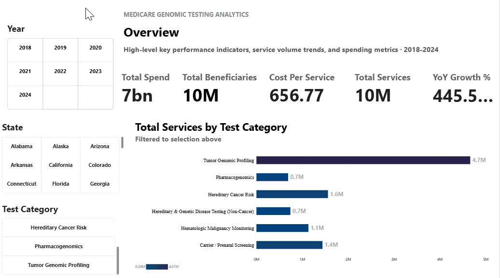
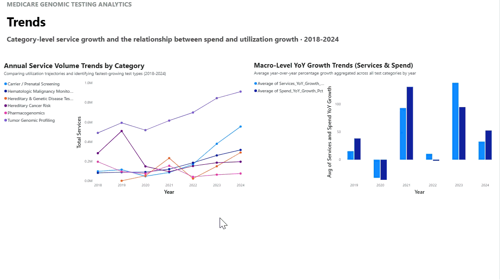
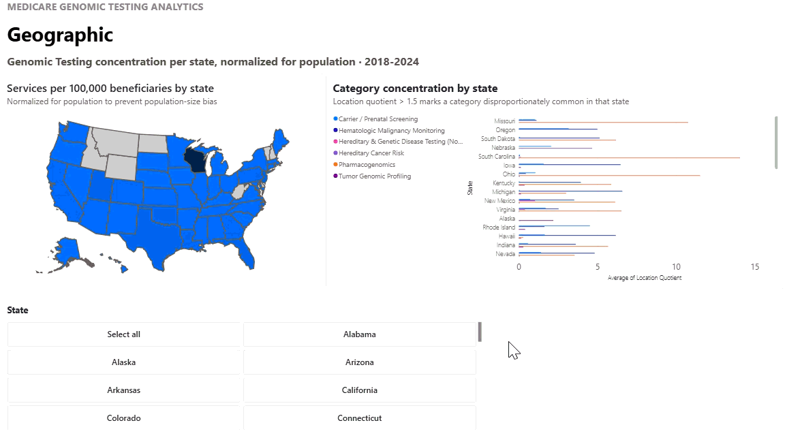
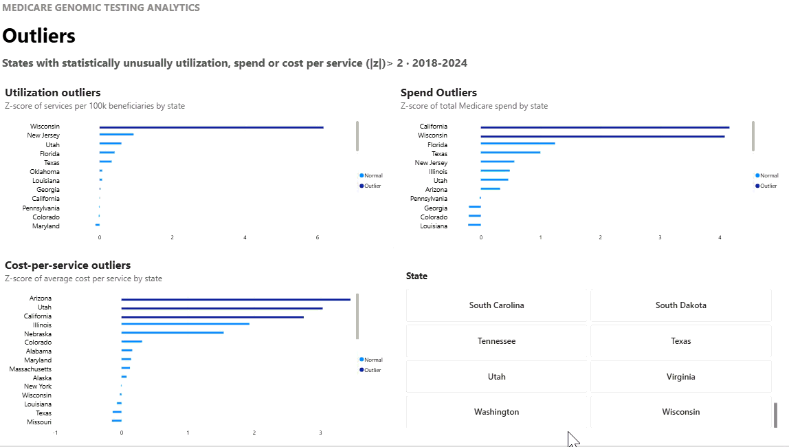
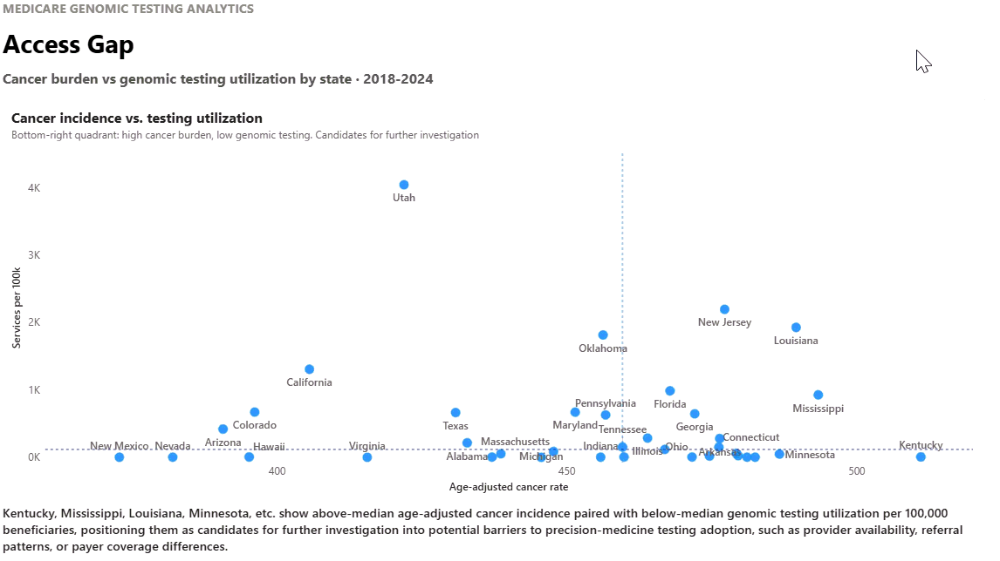

# Medicare Genomic Testing: Utilization, Spending, and the Precision Medicine Access Gap

A data analytics project examining how genomic and molecular diagnostic testing under Medicare is used across the United States, and whether that testing lines up with where cancer burden is actually highest. Built with SQL Server, Power BI, Excel, and Python.

## Why this project

I wanted a portfolio project that did two things at once: show the core toolkit a healthcare data analyst is expected to know (SQL, Power BI, Excel), and use a background most analysts don't have. I studied bioinformatics and computer science, so instead of a generic healthcare topic like patient wait times, I picked a genuinely niche area: genomic and molecular diagnostic testing billed to Medicare.

The project is deliberately built like a business analytics dashboard, not a research paper. The Power BI report follows a KPI to Trends to Geographic to Outliers to Access Gap structure, the same shape you'd expect from a dashboard built for a bank or retailer, not just a healthcare team. That was intentional. I wanted the same project to read as relevant for healthcare data analyst roles and general business analyst roles, since the underlying skills (KPI development, trend analysis, segmentation, outlier detection, geographic analysis, data integration) transfer directly.

## The main question

How does genomic testing utilization among Medicare beneficiaries vary across U.S. states, and does utilization appear aligned with disease burden?

That second half became the project's most interesting angle: comparing where genomic testing actually happens against where cancer incidence is highest, to flag states that might be worth a closer look. This is referred to throughout as the access gap analysis.

## Research questions

All 14 questions below were tracked as the project's acceptance criteria from day one. Answers and methodology are in the [Findings](#findings-and-answers-to-the-research-questions) section further down, each one links back to the methodology that produced it.

**Utilization**
1. How much genomic testing is performed through Medicare? (services, beneficiaries, spend)
2. How has genomic testing changed over time? Is it increasing or decreasing, and which years had the biggest jumps?
3. Which test categories are growing fastest?

**Geographic**
4. Which states have the highest and lowest utilization?
5. Do differences persist after normalizing for the size of each state's Medicare population (tests per 100,000 beneficiaries)?
6. Are specific test categories concentrated in particular states?

**Access Gap**
7. Are there states with relatively high cancer burden but relatively low genomic testing utilization?

**Financial**
8. How much is Medicare spending on genomic testing overall?
9. How does spending vary by test category and state?
10. Is spending growing at the same rate as utilization, or is one outpacing the other?

**Business analytics layer**
11. What are the core KPIs (total services, beneficiaries, spend, cost per service, services per 100k, YoY growth)?
12. Can the data be segmented interactively by state, year, category, and CPT code?
13. Which states are statistical outliers on utilization, spend, or cost per service?
14. What should a healthcare organization investigate based on these findings?

## Tools and skills used

This project touches the full analyst toolkit, applied to a real dataset from acquisition through to a finished dashboard.

- **Python**: pulled data directly from CMS and CDC APIs, including dynamic catalog resolution against `data.cms.gov`'s public data.json index rather than hardcoding dataset IDs, since those IDs change year to year.
- **SQL Server**: built the full data model as a set of views, including window functions (`LAG()` for year over year growth), statistical outlier detection (z-scores), and a Location Quotient calculation to measure geographic concentration.
- **Excel**: built the CPT to test category crosswalk using VLOOKUP, combined seven years of CMS CSVs into one working dataset, and used PivotTables for exploratory QA at two separate stages of the project.
- **Power BI**: a five page interactive dashboard with synced slicers, cross filtering, drill through, DAX measures, and conditional formatting.
- **Data cleaning and mining**: performed at every stage of the pipeline, in SQL (exclusion filters, threshold based suppression), in Excel (crosswalk QA, pivot table cross checks), and in Python (server side filtering during data acquisition).

This is best described as a **healthcare analytics** project in subject matter, but a **business analytics** and **data analytics** project in structure and skill set. The dashboard, the KPI framework, and the SQL modeling approach would look the same if the underlying data were retail sales or loan performance instead of medical claims.

## Data sources

- **CMS Medicare Physician & Other Practitioners by Geography and Service**, pulled via API for 2018 to 2024, filtered server side to the molecular pathology and genomic testing CPT range.
- **CMS Medicare Monthly Enrollment**, state level annual beneficiary counts, used to normalize utilization into a rate rather than a raw count.
- **CDC United States Cancer Statistics (USCS)**, state level age adjusted cancer incidence, available through 2022.

Because CDC data caps out at 2022 while CMS data runs through 2024, the access gap comparison is limited to years where both datasets overlap. This is called out explicitly rather than quietly ignored, see [Limitations](#limitations).

<details>
<summary><strong>How the data was pulled (click to expand)</strong></summary>

CMS versions this dataset by year, so a Python script resolves the correct API endpoint for each year dynamically against the `data.json` catalog rather than hardcoding dataset UUIDs, since those change. The script then paginates through each year's endpoint, filtering server side to HCPCS codes starting with 81, so the full multi million row national file is never downloaded. A second script pulls Medicare enrollment the same way. CDC cancer incidence was pulled through the CDC WONDER query tool, grouped by state and year, using age adjusted rate as the primary measure rather than raw counts, since raw counts are driven by population size and would bias any state comparison toward large states from the start.

</details>

## How the CPT to test category crosswalk was built

This is the part of the project that leans hardest on a bioinformatics background, and it took two rounds to get right.

**Round one.** I mapped the first 168 CPT and HCPCS codes returned by the initial data pull into six categories: Hereditary Cancer Risk, Tumor Genomic Profiling, Pharmacogenomics, Carrier and Prenatal Screening, Hematologic Malignancy Monitoring, and an Other bucket for anything that didn't fit cleanly (HLA typing, generic unspecified molecular pathology codes, protein based biomarker panels).

**Round two.** Once the crosswalk was applied to the full seven year dataset in Excel, a PivotTable QA check surfaced a serious problem: about 2.35 million services fell into a "Not Found" bucket because the codes appearing in the fuller dataset weren't in the original 168 code list. Rather than guess at these, I pulled the full list of unmatched codes ranked by volume and researched what each one actually tests for. This surfaced a large, legitimate category the original plan hadn't anticipated: non-cancer hereditary and genetic disease testing, covering things like inherited cardiac disease panels, hearing loss panels, ataxias, Huntington's disease, myotonic dystrophy, and exome or genome sequencing for undiagnosed conditions. That became a sixth core category rather than being forced into Other, since it represented real, sizable testing volume with a clear clinical identity of its own.

By the end, the crosswalk covered 291 codes across six core categories, with 41 codes correctly excluded as Other (transplant matching, generic unspecified codes, non genetic biomarker panels) and 13 excluded entirely as not genomic at all (routine urinalysis codes that matched the CPT filter by coincidence, and bacterial DNA and RNA panels that test pathogen genetics rather than human genetics).

The full crosswalk workbook, including the rationale written for every single code, is included in this repo at `data/reference/cpt_category_crosswalk.xlsx`.

## Key decisions made along the way

A few choices shaped the results and are worth stating plainly rather than leaving implicit.

**Excluding urinalysis and pathogen codes.** The initial CMS data pull filtered on CPT codes starting with 81, which is mostly molecular pathology, but also happens to include CPT 81000 through 81099, routine urinalysis. Those were dropped before any analysis, along with two codes (81513, 81514) that measure bacterial DNA and RNA in vaginal fluid rather than human genetic material.

**Enforcing the crosswalk's exclusions in SQL, not just in Excel.** Early in the Power BI build, the Other category was showing up as the single largest bucket in the dashboard, larger than every real category combined. The cause was that the crosswalk's Include or Exclude flag lived only in the Excel file, and the core SQL view was summing every category regardless of that flag. The fix was a `WHERE` clause filtering out Other and the excluded not genomic codes directly in the view, so the exclusion decision actually reaches every downstream number instead of living only on paper.

**Suppressing growth percentages calculated from a tiny base.** One category's year over year growth came out to over 340,000 percent, because the prior year's volume was 15 services. That single number was setting the scale for an entire chart and flattening every other bar to zero. Rather than delete the underlying data, the growth percentage itself is set to blank whenever the prior year's base falls below a minimum threshold (50 services for utilization, 100,000 dollars for spend), since a percentage calculated from a near zero base isn't a meaningful trend, it's an artifact of the denominator.

**Excluding Cologuard (CPT 81528) from the access gap comparison.** This was the most interesting data issue in the whole project. Wisconsin showed a rate of genomic testing per 100,000 beneficiaries about ten times higher than any other state, which isn't plausible. Digging into it, over 99 percent of that inflated number came from a single code, CPT 81528, the Cologuard colorectal cancer screening test. CMS attributes services to the billing lab's location, not the patient's, and Cologuard's manufacturer is headquartered in Wisconsin. Every Cologuard test billed nationally was effectively being counted as if the patient lived in Wisconsin. Cologuard was excluded from the access gap view specifically, both because it fixes the geographic distortion and because it's a genuinely different kind of test than the rest of the category: a primary screening test offered to average risk adults, not a diagnostic test ordered in response to an existing cancer or elevated risk.

**Not "fixing" Utah, only disclosing it.** After removing Wisconsin's Cologuard distortion, Utah remained the highest utilization state by a wide margin. This is plausibly the same billing location effect at smaller scale, since a major national hereditary cancer testing lab is headquartered there, but it's a softer case than Wisconsin's, so rather than exclude another code on a hunch, this is disclosed as a limitation instead. See [Limitations](#limitations).

**Choosing Average over Sum for rates and population fields.** In the access gap view, each state and year can have more than one row, one per relevant test category. Fields like cancer incidence rate and state population don't vary by category, so they repeat across those rows. Summing them would double count. Averaging identical duplicate values returns the correct value, which is also the semantically correct choice anyway, since a rate should never be summed in the first place.

**Building some Power BI pages off pre-joined SQL views instead of a full relational data model.** Rather than relating every table inside Power BI, several pages pull from views that already join the underlying tables in SQL (for example, the access gap view already merges Medicare utilization with CDC cancer statistics). This is a standard denormalized reporting pattern, not a workaround, and it was a deliberate tradeoff to keep the Power BI side simpler at the cost of doing more of the modeling work upstream in SQL.

## Excel work

Excel was used for more than formatting. Specifically:

- **Combining data**: the seven yearly CMS CSV files (2018 to 2024) were combined into one working dataset.
- **Applying the crosswalk**: VLOOKUP was used to join each CPT code against its assigned test category from the crosswalk table.
- **QA with PivotTables**: built pivot tables for services by year, top states by volume, top HCPCS codes by volume, and category by year, both as an initial exploratory pass and again after the crosswalk was expanded in round two, to confirm the "Not Found" bucket had actually gone to zero.
- **The crosswalk itself**: `cpt_category_crosswalk.xlsx`, included in this repo, contains every one of the 291 codes with its assigned category and a written rationale for that assignment, plus a formula driven summary tab using COUNTIF to tally codes per category.

## SQL work

All modeling logic lives in SQL Server as a set of views, so every number in the dashboard traces back to a single, auditable source rather than being computed ad hoc inside Power BI.

- `vw_GenomicKPIs`: the core aggregation, rolling raw claims data up to year, state, and test category, with total services, total beneficiaries, total spend, and cost per service.
- `vw_YearlyCategoryGrowth`: year over year growth in services and spend by category, using `LAG()` to compare each year against the one before it, with the threshold based suppression described above.
- `vw_GeographicServices`: a flat, pre-joined view combining utilization with state Medicare enrollment, used to calculate services per 100,000 beneficiaries.
- `vw_GenomicTestLocationQuotient`: measures whether a test category is disproportionately concentrated in a given state, calculated as that state's share of a category divided by the category's national share.
- `vw_StateOutliers`: flags states as statistical outliers (z-score above 2 or below negative 2) on utilization, spend, and cost per service.
- `vw_CancerIncidenceVsGenomicTesting`: joins Medicare utilization against CDC cancer incidence for the two cancer relevant categories, the source for the access gap analysis, with CPT 81528 excluded as described above.

<details>
<summary><strong>Full SQL for the core KPI view (click to expand)</strong></summary>

```sql
CREATE OR ALTER VIEW dbo.vw_GenomicKPIs AS
SELECT 
    Year,
    Rndrng_Prvdr_Geo_Desc,
    TEST_Category,
    SUM(Tot_Srvcs) AS Total_Services,
    SUM(Tot_Benes) AS Total_Beneficiaries,
    SUM(Avg_Mdcr_Pymt_Amt * Tot_Srvcs) AS Total_Spend,
    CASE 
        WHEN SUM(Tot_Srvcs) > 0 THEN SUM(Avg_Mdcr_Pymt_Amt * Tot_Srvcs) / SUM(Tot_Srvcs)
        ELSE 0 
    END AS Cost_Per_Service
FROM dbo.cms_2018_2024_combined
WHERE TEST_Category NOT IN ('Other', 'Exclude - Not Genomic')
GROUP BY Year, Rndrng_Prvdr_Geo_Desc, TEST_Category;
```

</details>

## The Power BI dashboard

Five pages, built to be read by an executive in under a minute, not a wall of every possible chart. The structure follows KPIs, then Trends, then Geographic, then Outliers, then Access Gap.

**Page 1, Overview**: five KPI cards (total services, beneficiaries, spend, cost per service, year over year growth), with slicers for year, state, and test category driving every visual on the page.



**Page 2, Trends**: a line chart of total services by test category over time, and a comparison of average spend growth against average utilization growth by year, answering whether spend is outpacing usage.



**Page 3, Geographic**: a shape map of services per 100,000 beneficiaries by state, alongside a Location Quotient chart showing which test categories cluster in which states.



**Page 4, Outliers**: three charts flagging states as statistical outliers on utilization, spend, and cost per service, using z-scores rather than a simple ranked list.



**Page 5, Access Gap**: a scatter plot of cancer incidence against testing utilization, one dot per state, with median reference lines splitting the chart into quadrants, and a written recommendation based on what falls into the high burden, low testing quadrant.



The `.pbix` file is included in this repo under `powerbi/`, so it can be opened directly in Power BI Desktop (free) for full interactivity, rather than relying only on the gifs above. A static PDF export is also included for a quick, no software required look.

## Findings and answers to the research questions

<details>
<summary><strong>Utilization (questions 1 to 3), click to expand</strong></summary>

Total services, beneficiaries, and spend are answered directly by the Overview page KPI cards, sourced from `vw_GenomicKPIs`. Utilization trends and category growth rates are shown on the Trends page, sourced from `vw_YearlyCategoryGrowth`, with the growth suppression rule described above applied so a handful of extreme percentages calculated from a tiny prior year base don't distort the chart.

</details>

<details>
<summary><strong>Geographic (questions 4 to 6), click to expand</strong></summary>

Highest and lowest utilization states, both raw and normalized per 100,000 beneficiaries, are shown on the Geographic page map. Category concentration by state is answered using a Location Quotient calculation (`vw_GenomicTestLocationQuotient`), filtered to states where a category's local share is at least 1.5 times its national share, so the chart highlights genuine concentration rather than noise.

</details>

<details>
<summary><strong>Access gap (question 7), click to expand</strong></summary>

Kentucky, Rhode Island, Nebraska, Ohio, and Kansas combine above median cancer incidence with genomic testing utilization under 10 services per 100,000 beneficiaries, among the largest gaps in the dataset. This is a descriptive pattern, not a causal claim. It flags where further investigation into testing adoption, provider availability, or payer coverage differences would be worthwhile, not a confirmed access barrier.

Two states required extra scrutiny before this analysis was trustworthy. Wisconsin initially appeared as the single highest utilization state by a wide margin, which turned out to be almost entirely CPT 81528 (Cologuard), a colorectal cancer screening test whose billing is concentrated at one national lab headquartered in Wisconsin. CMS attributes services to the billing location, not the patient's location, so this was inflating Wisconsin's number by an order of magnitude. That code was excluded from the access gap view. Utah remained the highest utilization state after that fix, plausibly for a similar reason, since a major hereditary cancer testing lab is headquartered there, but this is disclosed as a limitation rather than further filtered, since the evidence for it is weaker than Wisconsin's case.

</details>

<details>
<summary><strong>Financial (questions 8 to 10), click to expand</strong></summary>

Total and category level spend are answered by the Overview and Trends pages. Whether spend is outpacing utilization is answered by the year over year growth comparison chart on the Trends page, which compares average category level growth in spend against average category level growth in services. In most years measured, spend growth outpaced utilization growth, suggesting cost per test is rising, not just test volume.

</details>

<details>
<summary><strong>Business analytics layer (questions 11 to 14), click to expand</strong></summary>

Core KPIs are defined once in `vw_GenomicKPIs` and reused consistently across every page rather than recalculated differently in different places. Segmentation by state, year, category, and CPT code is available through synced slicers across all five pages. Outlier states are flagged statistically using z-scores (`vw_StateOutliers`) rather than an eyeballed ranked list, covering utilization, spend, and cost per service separately, since a state can be an outlier on one metric without being an outlier on another. The closing recommendation is stated above, under question 7.

</details>

## Limitations

- **Medicare only.** This analysis covers Medicare beneficiaries, mostly people 65 and older or with certain disabilities. It does not represent genomic testing patterns in the commercially insured or uninsured population, and shouldn't be read as a picture of national testing rates overall.
- **CMS geographic attribution reflects the billing lab, not the patient.** The Wisconsin and Cologuard issue described above is the clearest example, but it's a general characteristic of this dataset, not a one-off bug. Any state with a large national reference lab headquartered in it should be read with that in mind, including Utah.
- **CDC cancer incidence data runs through 2022, while CMS utilization data runs through 2024.** The access gap comparison is necessarily limited to the overlapping years. Utilization trends for 2023 and 2024 are shown on their own, without a matching incidence comparison.
- **CPT code sets change year to year.** New codes are added and old ones retired regularly in this space, so a category's growth over time partly reflects new tests coming to market and being assigned billing codes, not only existing tests being ordered more often.
- **Small cell suppression.** CMS suppresses low counts for privacy, so a blank value for a rare code in a low population state may reflect suppression rather than zero testing.
- **The aggregate growth comparison chart shows the average of each category's growth rate, not a single pooled growth rate across all categories combined.** A small category with a large percentage swing counts equally to a large category with a small swing in that particular chart. It's a legitimate summary metric, but a different number than "total spend grew by X percent," and is labeled as average category growth for that reason.
- **Category boundaries involved judgment calls.** A handful of codes could reasonably sit in more than one category (for example, tumor testing that's also used diagnostically for a hereditary condition). Every one of these calls is documented with its rationale in the crosswalk file, so the reasoning is visible and can be second guessed by anyone reviewing the work.
- **This is a descriptive analysis, not a causal one.** The access gap findings identify states that warrant further investigation. They don't establish why utilization is lower in those states, and shouldn't be read as proof of an access barrier on their own.

## Repository structure

```
medicare-genomic-testing-analysis/
├── README.md
├── requirements.txt
├── data/
│   ├── raw/                  # CMS, enrollment, and CDC source pulls
|   └── processed/            # CMS, enrollment, and CDC files cleaned
│   └── reference/
│       └── cpt_category_crosswalk.xlsx
├── powerbi/
│   ├── Genomic_Testing_Dashboard.pbix
│   └── Dashboard.pdf
├── src/
│   └── data_cleaning/                 # Data Cleaning scripts
│   └── data_acquisition/                 # Python acquisition scripts
|   └── sql/
│       └── views/                # all views described above
|       └── queries/              # queries for building our data model in PowerBI
└── assets/                   # dashboard gifs and screenshots for this README
```

## Reproducing this project

pip install -r requirements.txt

1. Run the Python scripts in `src/data_acquisition/` to pull CMS and CDC source data.
2. Run the Python scripts in `src/data_cleaning/` to clean the CMS data.
3. Run the SQL scripts in `sql/views/` against a SQL Server instance to build the view layer.
4. Open `powerbi/genomic_testing_dashboard.pbix` in Power BI Desktop and point it at your SQL Server instance under Data Source Settings.